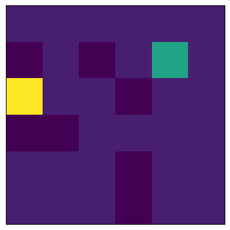

# Implementation of a parallel Q-learning algorithm on a gridworld environment with pyTorch
I was inspired by course CS 285 at UC Berkeley.

Q-learning with replay buffer and target network: 
In a loop:
  1. Save target network parameters: $\Phi^{'}\leftarrow \Phi$ 
 $N \times \rightarrow$    2. Collect M datapoints $(s_i,a_i,s_i^{'},r_i)$ using some policy, add them to $\beta$  
 $K \times \rightarrow$       3.  Sample a batch $(s_i,a_i, s_i^{i},r_i)$ from $\beta$ 
        4. $\Phi\leftarrow\alpha\sum_{i}\frac{dQ_{\Phi}}{d\Phi}(Q_{\Phi}(s_i,a_i) -[r(s_i,a_i)+\gamma max_{a^{'}} Q_{\Phi^{'}}(s_i,a_i)])$  

The environement is a grid of size $(n_x,n_y)$. An agent has to reach a point called G. 
There are 8 possible actions: up, right, left, down, up-right, up-left, down-right, down-left.
Integers N and K are the number of iterations for the loop 2 of the collection of the datapoints from the buffer and for the loop 3 with the batch sampling and the update. The process is repeted $n_{epochs}$ times. 

* The file env.py implements the environment which is the grid.
* The file agent.py implements the agent
* The file qlearning.py implements the loop in a function called qlearn.
* The file Qfunc.py implements the action-value network Q.
* The file Buffer.py implements the buffer containing batchs (s,a,s',r)
* The file main.py calls qlearn and gives values for $K$, $N, n_{epochs}$, gradient descent rate $\alpha$, $n_x, n_y$ and the batch size.   

Futur works:
Calculation of the values of the Q function and calculation of the return obtained, and compare the curves obtained according to the iterations during the learning. 

